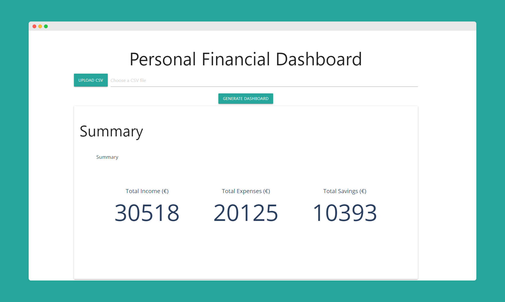

# Financial Dashboard in Python

A Flask-based financial dashboard that enables users to upload CSV files containing transaction data and view insightful summaries and visualizations of their income, expenses, and savings. The dashboard provides monthly breakdowns, income and expense charts, and savings metrics.



## Features

- **Upload CSV Files:** Easily upload a CSV file with your transaction data.
- **Monthly Income and Expense Tracking:** View your monthly income and expenses in grouped bar charts.
- **Category-wise Expense Breakdown:** Analyze expenses by category, excluding "Savings" from the breakdown.
- **Total Income, Expenses, and Savings Summary:** Get a snapshot of total income, total expenses, and total savings with an intuitive indicator display.
- **Savings Percentage Calculation:** Understand the percentage of income saved.

## Installation

1. Clone this repository:
   ```bash
   git clone https://github.com/Incipiens/FinancialDashboardPython.git
   ```

2. Navigate to the project directory:
   ```bash
   cd FinancialDashboardPython
   ```

3. Create a Python 3.10 virtual environment:
   ```bash
   python3.10 -m venv env310
   ```


4. Activate the virtual environment:
   - On Windows:
   ```bash
   env310\Scripts\activate
   ```

   - On macOS/Linux:
   ```bash
   source env310/bin/activate
   ```  

5. Install required packages within the activated environment:
   ```bash
   pip install -r requirements.txt
   ```  

6. Run the app:
   ```bash
   python financial.py
   ```
   The app will be available at http://localhost:5000/.

## Docker Deployment
To run the Financial Dashboard application using Docker:
1. Build the Docker image:
   ```bash
   docker build -t financial-dashboard .
   ```

2. Run the Docker container:
   ```bash
   docker run -p 5000:5000 financial-dashboard
   ```

3. Access the application: Open your browser and navigate to http://localhost:5000/.
This will start the application in a Docker container, making it accessible on port 5000 of your local machine.

## Usage
1. Navigate to the homepage of the application.
2. Upload a CSV file with columns Date, Category, and Amount:
  - Date: The date of the transaction (format: YYYY-MM-DD).
  - Category: The category for each transaction (e.g., Groceries, Rent).
  - Amount: The transaction amount, where positive values indicate income and negative values indicate expenses.
3. View the financial summaries and insights, including:
  - Income vs. Expenses Chart: A grouped bar chart of income and expenses by month.
  - Expenses by Category: A pie chart of expenses by category, excluding savings.
  - Savings Summary: Displays total income, total expenses, and savings with the savings percentage.

## Files
- financial.py: Main application file with routes and logic for processing the CSV file and generating graphs.
- templates/index.html: Template for displaying the dashboard with charts.
- requirements.txt: Dependencies for the project.

## Example CSV Format
```csv
Date,Category,Amount
2024-01-01,Salary,2000
2024-01-10,Rent,-800
2024-01-15,Groceries,-150
2024-02-01,Salary,2000
2024-02-10,Rent,-800
2024-02-15,Entertainment,-120
```

## Contributing
Feel free to open issues or submit pull requests for improvements and new features!

## License
This project is open-source and available under the MIT License.
